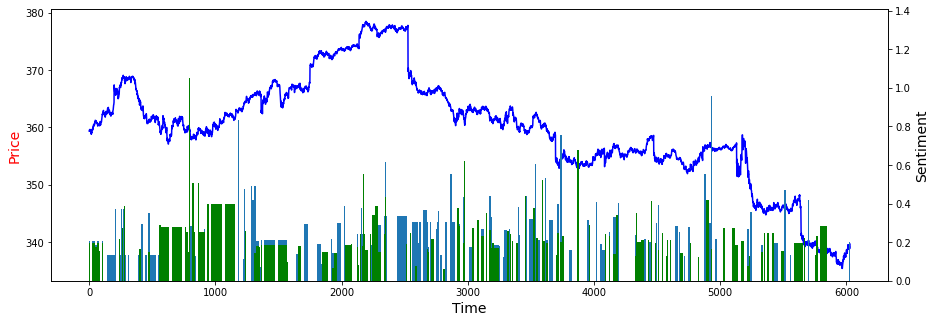
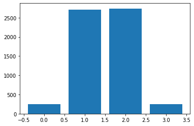
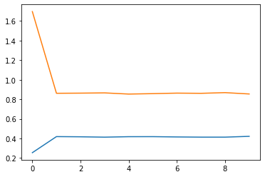
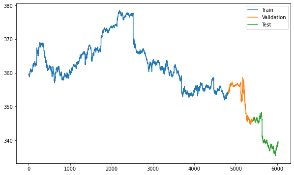

# Stock Prediction Effectiveness

<h2>1 - Data Preperation</h2>
<h3>1.1 - Importing Data/Libraries</h3>

We begin by importing the necessary libraries and the following classes:

<ul>
<li>The Analyzer Class: </li>

This class contains all necessary data and methods to operate on and prepare the data to be utilized within the LSTM/Markov models.
 The class also contains methods to visualize data.

<li>The LSTM Class: </li>

This class contains all necessary data and methods to create and fit an LSTM network with varying amounts of inputs and timesteps. To train an LSTM network, an
instance of this class must be created and then the divide_data method must be called, followed by the run method. This class also contains methods to visualize the data
and generate future predictions.

<li>The Markov Class: </li>

This class contains all necessary data and methods to create and optimize a Markov chain with varying degrees. In order to run and train a Markov chain model
an instance of this class must be created and then the optimal_degree method must be utilized.

</ul>
<h3>1.2 - Preparing The Subreddit Sentiment Data </h3>

We now group all data points in the Subreddit Sentiment data by the day on which they occured. 

<h3>1.3 - Preparing The Stock Price Data</h3>

We now group all data points in the Stock data by the day on which they occured.  

<h3>1.4 - Merging The Sentiment Data And Stock Price Data</h3>

Now the two dataframe are merged to form the complete dataframe. 

<h3>1.5 - Determining Percent Change In Price</h3>

We Now find the percent chagne which can be done by subtracting the prices column by the prices column shifted down one. 

<h2>2 - Visualizing Trends In News Sentiment and Stock Prices</h2>
<h3>2.1 - Plotting Sentiment Versus Price</h3>

This plot showcases the sentiment intensities at given time steps along with the stock price. In this plot the blue bars are the negative sentiment and green bars
are positive sentiment.

  

<h2>3 - Markov Chains</h2>
<h3>3.1 - Plotting Hist</h3>

 We first showcase a histogram of the frequency of the markov bins. This will show which bins are more likely to be guessed and give an idea on how much the
stock might fluctuate, considering more occurances of the larger shifts would indicate a larger percentage of dramatic shifts in price, thus the stock is more volatile.

  

<h3>3.2 - Nth Degree Markov Chains</h3>

 Utilizing Nth degree markov chains, we can predict price movements to a varying degree of accuracy depending on the degree of the chain. Therefore, we must find the optimal degree.

<h3>3.3 - Optimizing Nth Degree Markov Chains</h3>

 We can find the optimal degree by training models with a range of degrees and pick the degree that produced the highest accuracy and lowest MSE. This graph shows the results of testing the degrees from 0-9. The highest accuracy achieved on this graph was 41.2%, meaning the model could correctly categorize the direction and magnitude of the stock movement 41.2% of the time.

  

 The resulting optimal degree will not always be the optimal degree for every markov chain trained on the same data, considering that the optimal degree is largely dependent on how the individual model was trained. Since markov chains are largely based on chance, the chance there is a variation in the trained models is high.

<h2>4 - Univariate LSTM Network</h2>
<h3>4.1 - Processing And Splititng Data</h3>

  

<h3>4.2 - Fitting The Model</h3>
<h3>4.3 - Plotting True And Predicted Values</h3>
<h3>4.4 - Comparing n Values</h3>
<h2>5 - Multivariate LSTM Network Using Reddit News Sentiments</h2>
<h3>5.1 - Processing And Splitting Data </h3>
<h3>5.2 - Fitting The Model </h3>
<h3>5.3 - Plotting True And Predicted Values </h3>
<h3>5.4 - Prediction Of Future Values </h3>
